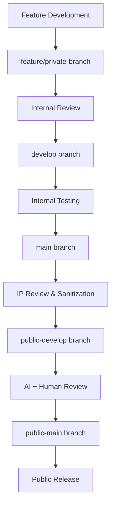

# Branch Strategy & Repository Management

## Overview

This document outlines the branch strategy for the Digital Me Community Edition repository, designed to support both private development and public open source release with human and AI review processes.

## Branch Structure

### 🔒 **Private Branches (Internal Development)**

#### `main` (Private)
- **Purpose**: Primary development branch with complete codebase
- **Access**: Private, internal team only
- **Content**: Full Digital Me system including enterprise features
- **Review**: Internal team review only

#### `develop` (Private)
- **Purpose**: Integration branch for feature development
- **Access**: Private, internal team only
- **Content**: Latest features and integrations
- **Review**: Internal team review only

#### `feature/*` (Private)
- **Purpose**: Individual feature development
- **Access**: Private, feature developers only
- **Content**: Specific feature implementations
- **Review**: Internal team review only

### 🌐 **Public Branches (Open Source)**

#### `public-main` (Public)
- **Purpose**: Public open source release branch
- **Access**: Public, community accessible
- **Content**: Community Edition only (no enterprise IP)
- **Review**: Human + AI review before merge

#### `public-develop` (Public)
- **Purpose**: Public integration branch
- **Access**: Public, community accessible
- **Content**: Community features and improvements
- **Review**: Human + AI review before merge

## Review Process

### 🔍 **AI Review Requirements**

All changes to public branches must pass AI review:

1. **IP Protection Scan**: Verify no enterprise IP leakage
2. **Policy Compliance**: Check against UNIVERSAL_PROJECT_FILE_MANAGEMENT_POLICY.md
3. **Security Scan**: Automated security vulnerability detection
4. **Code Quality**: Linting, formatting, and test coverage checks
5. **Documentation**: Ensure documentation is complete and accurate

### 👥 **Human Review Requirements**

All changes to public branches must pass human review:

1. **Architecture Review**: Senior architect approval
2. **Security Review**: Security team approval
3. **Community Impact**: Community team approval
4. **Legal Review**: Legal team approval for licensing

## Workflow

### 🚀 **Development Workflow**



### 📋 **Review Checklist**

#### AI Review Checklist
- [ ] No enterprise IP in public branches
- [ ] Policy compliance verified
- [ ] Security scan passed
- [ ] Code quality gates passed
- [ ] Documentation complete
- [ ] Tests passing with >90% coverage

#### Human Review Checklist
- [ ] Architecture approved
- [ ] Security approved
- [ ] Community impact assessed
- [ ] Legal compliance verified
- [ ] Release notes prepared

## Branch Protection Rules

### 🔒 **Private Branches**
- Require pull request reviews
- Require status checks to pass
- Require branches to be up to date
- Restrict pushes to authorized users

### 🌐 **Public Branches**
- Require pull request reviews (2+ reviewers)
- Require AI review to pass
- Require human review to pass
- Require status checks to pass
- Require branches to be up to date
- Restrict pushes to authorized users
- Require signed commits

## Automation

### 🤖 **AI Review Automation**

```yaml
# .github/workflows/ai-review.yml
name: AI Review
on:
  pull_request:
    branches: [public-main, public-develop]

jobs:
  ai-review:
    runs-on: ubuntu-latest
    steps:
      - name: IP Protection Scan
        run: ./scripts/ip-protection-scan.sh
      
      - name: Policy Compliance Check
        run: ./scripts/policy-compliance-check.sh
      
      - name: Security Scan
        run: ./scripts/security-scan.sh
      
      - name: Code Quality Check
        run: ./scripts/code-quality-check.sh
      
      - name: Documentation Check
        run: ./scripts/documentation-check.sh
```

### 🔍 **Human Review Automation**

```yaml
# .github/workflows/human-review.yml
name: Human Review
on:
  pull_request:
    branches: [public-main, public-develop]

jobs:
  human-review:
    runs-on: ubuntu-latest
    steps:
      - name: Notify Reviewers
        run: ./scripts/notify-reviewers.sh
      
      - name: Create Review Checklist
        run: ./scripts/create-review-checklist.sh
      
      - name: Wait for Reviews
        run: ./scripts/wait-for-reviews.sh
```

## Security Considerations

### 🔐 **Access Control**

- **Private Branches**: Internal team only
- **Public Branches**: Community accessible
- **Review Process**: Multi-layer approval required
- **IP Protection**: Automated scanning + human review

### 🛡️ **IP Protection**

- **Automated Scanning**: Continuous IP detection
- **Human Review**: Manual IP verification
- **Legal Review**: Legal team approval
- **Audit Trail**: Complete change tracking

## Monitoring & Metrics

### 📊 **Key Metrics**

- **Review Time**: Average time from PR to merge
- **Review Quality**: Number of issues caught by AI vs human review
- **IP Leakage**: Zero tolerance policy
- **Community Engagement**: Public branch activity

### 🚨 **Alerts**

- **IP Leakage**: Immediate alert to security team
- **Policy Violations**: Alert to compliance team
- **Security Issues**: Alert to security team
- **Review Delays**: Alert to project managers

## Best Practices

### ✅ **Do's**

- Always use feature branches for development
- Run AI review before human review
- Document all changes thoroughly
- Keep private and public branches synchronized
- Regular security and IP audits

### ❌ **Don'ts**

- Never push enterprise IP to public branches
- Never bypass review processes
- Never merge without proper approvals
- Never skip security scans
- Never ignore policy violations

## Emergency Procedures

### 🚨 **IP Leakage Response**

1. **Immediate**: Remove public access to affected branch
2. **Investigation**: Determine scope of leakage
3. **Containment**: Prevent further exposure
4. **Remediation**: Remove leaked content
5. **Prevention**: Update processes to prevent recurrence

### 🔧 **Process Improvements**

- Regular review of branch strategy
- Continuous improvement of AI review
- Training for human reviewers
- Regular security audits
- Community feedback integration

## Conclusion

This branch strategy ensures that the Digital Me Community Edition maintains the highest standards of security, quality, and community engagement while protecting enterprise intellectual property and enabling efficient development workflows.

The combination of AI and human review processes provides multiple layers of protection while maintaining development velocity and community participation.
